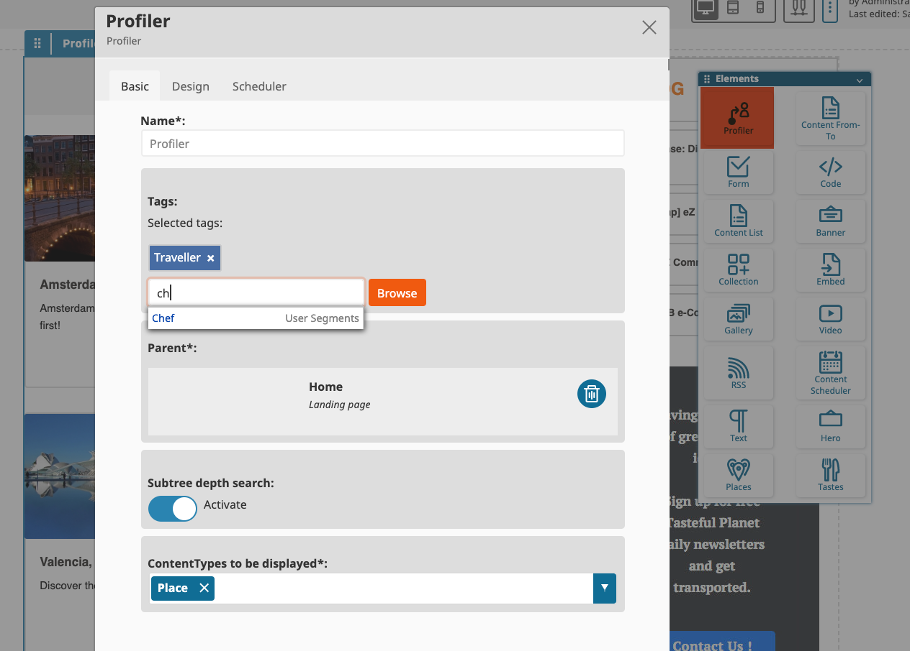
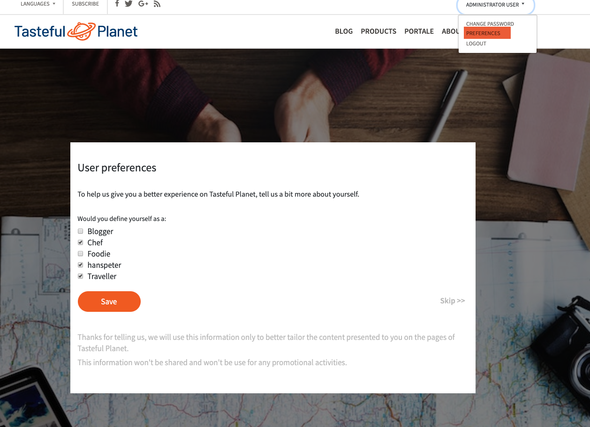

## Introduction

This implementation introduces the Profiler block for eZ Platform v2.2+ Enterprise demo. The Profiler block requires a new Attribute Type [eztagsattributetype](https://github.com/arfaram/eztagsattributetype) bundle.
        
## Info

This bundle works only with the [ezplatform-ee-demo](https://github.com/ezsystems/ezplatform-ee-demo). The templates are adapted for this repository.

## Requirement 

- Ez Platform **Enterprise** demo 2.3+
- Dependency:

```
composer require arfaram/eztagsattributetype
```
 
## Installation 

- Clone this repository in `src/EzSystems/ProfilerBlockBundle`.

Add following to `AppKernel.php`

```
        $bundles = [
            // ...
            new EzSystems\ProfilerBlockBundle\EzSystemsProfilerBlockBundle(),
        ];
```
 
 - Add below to your composer.json
 
 ```
     "autoload": {
         "psr-4": {
             "EzSystems\\ProfilerBlockBundle\\": "src/EzSystems/ProfilerBlockBundle/"
         },
```

In app/config/routing.yml
 
```
ez_systems_profiling:
    resource: "@EzSystemsProfilerBlockBundle/Resources/config/routing.yml"
    prefix:   /
```
 
- In layout/header.html.twig
 
Add below link after the `Change Password` one:
 
```
<a class="dropdown-item" href="{{ path('ezsystems.user_preferences') }}" title="{{ 'preferences'|trans }}">{{ 'preferences'|trans }}</a> 
```

- Add in `web/assets/scss/demo.scss` at the first line:
``` 
@import 'src/EzSystems/ProfilerBlockBundle/Resources/public/scss/preferences.scss';
```  

 
 - clear the symfony cache
 - generate assets `yarn encore dev` 
 
 
 ## How it works





