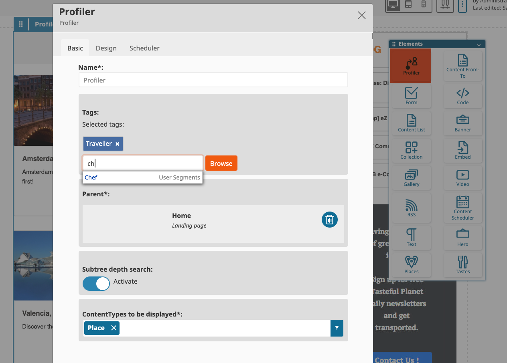

## Introduction

This implementation introduces the Profiler block for eZ Platform v3+ Enterprise. The Profiler block requires a new Attribute Type [eztagsattributetype](https://github.com/arfaram/eztagsattributetype) bundle.
        
## Requirement 

- Ez Platform **Enterprise** 3+
- https://github.com/arfaram/eztagsattributetype
 
## Installation 

- Add the differents files and directory to your project. 
- Merge `services.yaml` with the default one.

## Usage

- Add `tags` fieldType to user and some other contentTypes
- Use the same taxonomy for user and content
- setup the Profiler block with some taxonomy 

The Frontend Design is up to you ;) 
 
 
 ## How it works

